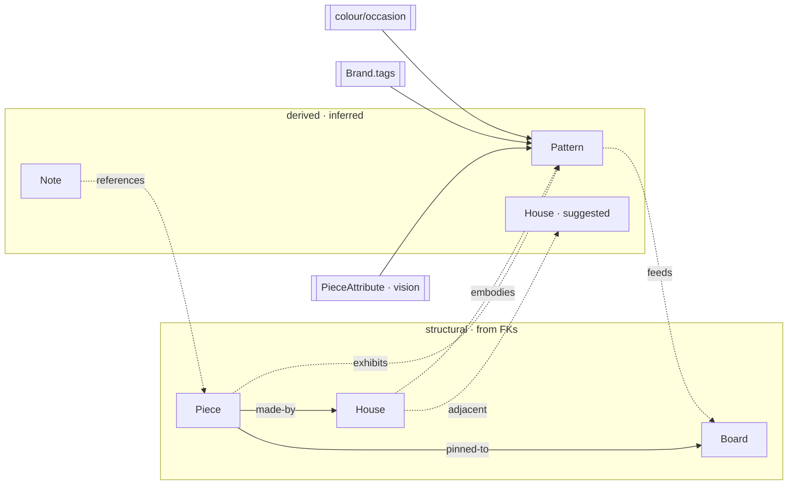
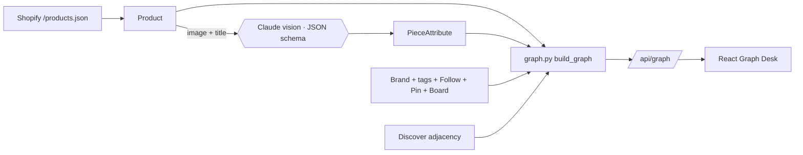

# ÉDIT — The Taste Graph: data model & build plan

The "Graph Desk" is not a new database. It's a **projection** of the relational data we
already have, plus a layer of **derived inference**. This doc defines how we build that graph
from structured data — the node/edge model, the LLM enrichment that gives it real depth, how
"pattern" nodes are derived, and the API/React that serve it.

---

## 1. The core idea

Everything on the desk is one of two things:

- **Structural** — read straight from foreign keys we already have. `Product → Brand`,
  `Pin → Board`, `Follow → Brand`. If you read FKs as edges, the schema *is* a graph. Free.
- **Derived** — the intelligence. Pattern nodes, "reminds me of," "you didn't notice this."
  None of it is stored; it's **aggregation + co-occurrence over your corpus of saves**. This is
  what makes it a second brain instead of a table viewer.

Build order of operations: read the hard edges from Django FKs → enrich pieces → compute the
soft edges and pattern nodes → assemble a curated subgraph → serve.

```
 relational data            enrichment            inference               surface
 ┌───────────┐   vision    ┌────────────┐        ┌──────────┐   /api/    ┌──────────┐
 │ Brand     │──tags──┐    │PieceAttr   │──┐     │ patterns │   graph/   │  React   │
 │ Product   │────────┼──▶ │ (garment,  │  ├──▶  │ edges    │──────────▶ │  Graph   │
 │ Pin/Board │  FKs    │    │  fabric…)  │  │     │ subgraph │            │  Desk    │
 │ Follow    │─────────┘    └────────────┘  │     └──────────┘            └──────────┘
 └───────────┘         structural edges ────┘        derived
```

---

## 2. Node types — where each comes from

| Desk node | Source model | Node id | On the desk? |
|---|---|---|---|
| **Piece** | `Product` (pinned, or recently surfaced) | `piece:<uuid>` | your pins |
| **House** | `Brand` (followed) | `house:<key>` | followed + linked |
| **House · suggested** | `Brand` `in_library=False` (Discover) | `house:<key>` (+suggested) | top few |
| **Pattern · derived** | *computed, not stored* | `pattern:<dim>:<value>` | top N |
| **Board** | `Board` | `board:<slug>` | yours |
| **Note / clipping** | `DiaryEntry` (Clips later) | `note:<uuid>` | recent |

`pattern:<dim>:<value>` examples: `pattern:detail:stiff-collar`, `pattern:fabric:undyed-cotton`,
`pattern:tag:minimalist`, `pattern:color:rose`.

---

## 3. Edge types — how each line is drawn

| Edge | From → To | Kind | Computed from | Weight |
|---|---|---|---|---|
| made-by | piece → house | **structural** | `Product.brand` | 1 |
| pinned-to | piece → board | **structural** | `Pin` | 1 |
| exhibits | piece → pattern | derived | piece carries the pattern's attribute/tag/colour | 1 |
| embodies | house → pattern | derived | `Brand.tags` ∈ pattern | tag freq |
| adjacent ("reminds me of") | house → house | derived | shared tags — **the Discover engine already does this** | # shared |
| feeds | pattern → board | derived | a board's pins share the pattern | overlap |
| references | note → piece/house/pattern | mixed | explicit link or date proximity | — |

Solid lines = structural. Dashed / accent lines = derived (this matches the design: the dashed
red edge is a suggested/derived connection).

---

## 4. Piece enrichment — the vision/LLM pass (the depth layer)

**Why.** Pattern quality is capped by how well we describe a *piece*. Today a product only
inherits its brand's coarse tags (`minimalist`, `french`). To derive garment-level patterns —
"stiff collars," "unbleached cotton," "bias-cut" — we need **piece-level attributes**. That
requires looking at the actual garment.

**Approach.** A batch enrichment step: for each `Product`, send its **image + title/type** to a
fast Claude model and force a **structured attribute object** out via a JSON schema (tool use).
Store it on a new `PieceAttribute` row. (At build time we'll follow the `claude-api` skill for
exact model id / vision + structured-output syntax; a fast model — Haiku 4.5 — is right for a
few-hundred-item, cost-sensitive batch.)

**Extracted schema — category-aware.** You follow apparel *and* jewelry, footwear, bags, and
athleisure — so a single garment schema won't do (`neckline` is meaningless for a ring). The
vision pass first classifies a **`category`**, then fills **shared** dimensions (true of any
object) plus a **category-specific** block. Irrelevant fields are simply null.

`category` ∈ `apparel · footwear · jewelry · bag · accessory · activewear`

**Shared — every piece (this is where cross-category taste lives):**

| Field | Example values |
|---|---|
| `material` | cotton · silk · wool · cashmere · leather · denim · linen · **gold** · silver · pearl · enamel · gemstone · suede · technical |
| `palette` | black · ecru · **rose** · olive · camel · navy · gold · undyed · multi |
| `formality` | casual · day · evening · occasion · active |
| `descriptors` | 2–3 free: **sculptural** · soft · romantic · minimal · playful |

**Category-specific:**

| Category | Fields |
|---|---|
| `apparel` | garment_type · silhouette · **neckline** · length · **details** (pleated · undyed · structured…) |
| `footwear` | shoe_type (flat · heel · boot · sneaker · mule · ballet) · heel · toe |
| `jewelry` | jewelry_type (necklace · ring · earring · bracelet · cuff) · motif · scale |
| `bag` · `accessory` | bag_type · structure · hardware |
| `activewear` | activewear_type (legging · short · sports-bra · jacket) · support · technical |

Those fields make the design's patterns real, across categories:
`apparel · neckline=collar · details=structured` → **stiff collars**;
`material=cotton · details=undyed` → **unbleached cotton**;
`material=gold · descriptor=sculptural` on a ring **and** a coat → **sculptural gold**;
`palette=rose` on a dress **and** a shoe → **a soft rose**.

**Pipeline.** Enrich on ingest (each new product) **and** a `enrich_pieces` backfill command for
the existing catalogue. Idempotent (skip already-enriched unless `--force`), cached per product,
records `model_id` + `enriched_at` for reproducibility. Flatten the fields into a `piece_tags`
list so pattern counting is a simple aggregation.

---

## 5. Deriving the Pattern nodes (this is Phase 3, finally)

A pattern node = **a value that recurs across your corpus, surfaced as a thing.**

1. **Corpus** = your pinned pieces + their houses + your followed houses. Weight pins > follows.
2. **Tally frequencies** across dimensions we now have:
   - piece attributes (`piece_tags` from §4) — the fine ones
   - brand aesthetic **tags** — the coarse ones
   - **colour** families, **occasion**, **tier**, **region**
3. A value with weight ≥ threshold (≈3) becomes a **Pattern node**. Its `weight` = the count;
   it draws an `exhibits`/`embodies` edge to every corpus item that carries it. The design's
   *"Stiff collars — 9 saves across 4 houses"* is exactly **count + spread** (how many, over how
   many houses/time).
4. Rank patterns by weight × spread; the strongest become the black desk nodes, the rest live in
   the Index. "ÉDIT noticed, you didn't" = simply surfacing a high-weight pattern you never named.
5. **Cross-category patterns are the real signal.** A pattern from the *shared* dimensions —
   `material=gold`, `palette=rose`, `descriptor=sculptural` — that spans a **ring, a shoe, and a
   dress** reveals an eye far better than any single-category one. So fold **category-spread** into
   the ranking (how many *categories* a pattern touches, not just how many houses). Category-specific
   patterns (collars, heel shape, enamel, technical fabric) then hang beneath the cross-category ones.

Derived **on the fly** each request (always fresh, no sync problem). Materialize into a `Pattern`
table only if performance later demands it.

---

## 6. What's on the desk vs. in the Index

You have 84 houses and hundreds of pieces — dumping them all on a canvas is unreadable. So:

- **Index (left rail) = everything**, grouped + searchable.
- **Desk (canvas) = a curated working subgraph** (~15–30 nodes): your pinned pieces + their
  houses + top-N derived patterns + your boards + a handful of suggestions + recent notes.
  Focusing a node (from the Index or a link) recenters the desk on **its neighborhood**. Grows as
  you pin. This is what the v8 design does.

```
 INDEX (all of it, searchable)        DESK (a readable neighborhood)
 ├─ 01 Pieces        (238)            pins ──made-by──▶ houses
 ├─ 02 Houses        (84 + suggested)   │                 │
 ├─ 03 Patterns      (derived)          └──exhibits──▶ patterns ◀─embodies─┘
 ├─ 04 Boards        (yours)                 │
 └─ 05 Clippings     (notes)                 └──feeds──▶ boards
```

---

## 7. Positions & arrangement — user state

"Arrangement: **Yours** — saved as you move" means node x/y is **per-user data we persist**.

- **`NodePosition(node_id, x, y, updated_at)`** — the saved "Yours" layout. (single-user v1)
- **"By day clipped"** lens = *computed*, not stored: `x` = the item's clip/publish date on a time
  axis, `y` = a lane per node type. Deterministic.
- First render with no saved position → a **force-directed seed layout** (compute once) → you drag
  → we `PATCH` the new position → it sticks.

---

## 8. The API

```
GET   /api/graph/              → { nodes:[ {id,type,label,subtitle,tags,image,followed,
                                            suggested,weight,x,y} ],
                                   edges:[ {from,to,type,derived,weight,dashed} ],
                                   stats:{pinned,follows}, focus }
GET   /api/graph/node/<id>/    → detail: {kind,title,desc,image,tags,meta[],connected[],boards[]}
PATCH /api/graph/positions/    → { "<node_id>": {x,y}, … }   (save the Yours arrangement)
```

Pin/follow reuse the existing endpoints — and because pinning creates a structural edge, **pinning
literally draws a line on the desk** (the design's "pinning draws the line").

---

## 9. New models (that's all)

| Model | Fields | Purpose |
|---|---|---|
| `PieceAttribute` | `product` (1:1), `attributes` (JSON), `piece_tags` (list), `model_id`, `enriched_at` | vision-derived per-piece attributes |
| `NodePosition` | `node_id` (unique), `x`, `y`, `updated_at` | saved "Yours" desk layout |

Patterns stay **derived** (no table). Notes reuse `DiaryEntry` for now.

---

## 10. Build order

1. **`PieceAttribute` model + `enrich_pieces` command** — the vision pass over the catalogue
   (batch, idempotent, fast model). Verify attributes on real pieces.
2. **`catalog/graph.py`** — `build_graph(focus=None)`: assemble nodes + structural edges from FKs,
   derive patterns from `piece_tags`+tags+colour, add adjacency from the Discover engine, curate
   the ~15–30-node neighborhood, seed positions.
3. **Endpoints + `NodePosition`** — `/api/graph/`, `/api/graph/node/<id>/`, `PATCH positions`.
   Verify the real derived graph as JSON.
4. **React Graph Desk** — port the v8 canvas (pan/zoom/drag, Index, detail panel, capture bar)
   against the endpoint; wire pin/follow so edges appear live.

---

## 11. Diagram — the model




